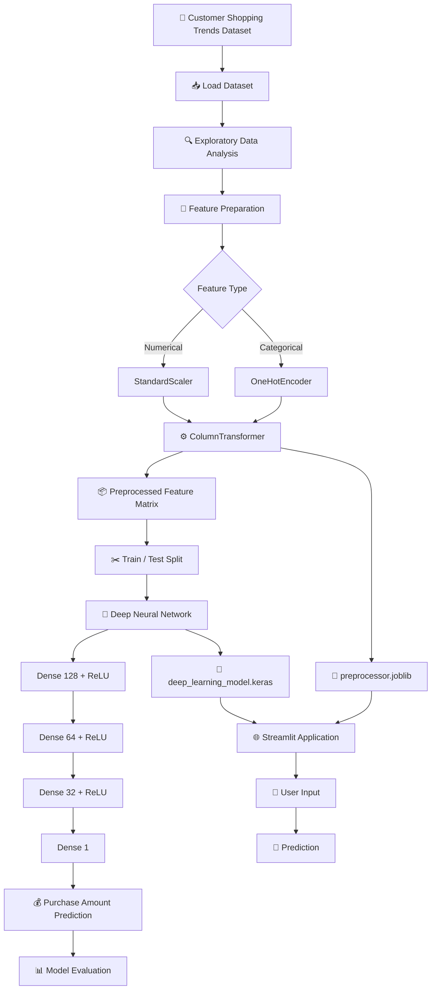
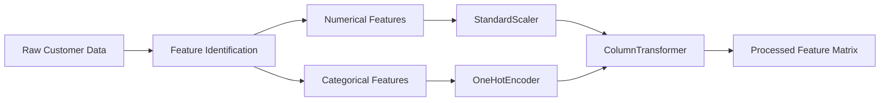
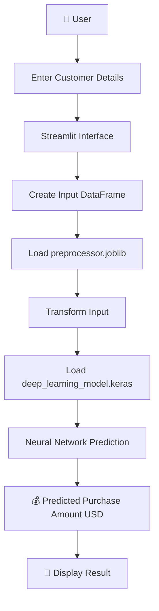

# 🛒 Customer Shopping Trends — Deep Learning Purchase Predictor

<p align="center">
  
  
  
  
  
</p>

<p align="center">
  <strong>Predict customer purchase amounts using a Deep Neural Network trained on shopping behaviour and customer attributes.</strong>
</p>

<p align="center">
  
  
  
  
</p>

---

## 📌 Project Overview

**Customer Shopping Trends — Deep Learning Purchase Predictor** is a machine learning application that predicts a customer's potential **purchase amount in USD** based on their shopping behaviour, demographic information, ratings, and other categorical attributes.

The project combines:

* 📊 Data preprocessing
* 🧹 Feature transformation
* 🧠 Deep Neural Networks
* 📈 Regression
* 🔬 Model evaluation
* 💾 Model serialization
* 🌐 Streamlit deployment

The final application allows users to enter customer information and receive an estimated purchase amount.

---

## 🎯 Objective

The primary objective of this project is:

> **Predict the expected customer purchase amount using customer shopping-trend attributes.**

### Target Variable

```text
Purchase Amount (USD)
```

### Removed Identifier

```text
Customer ID
```

The model treats the problem as a **regression task**, because the output is a continuous monetary value.

---

# 🧠 System Architecture



---

# 🔬 Machine Learning Pipeline

The project follows the following workflow:

```text
Dataset
   ↓
Data Inspection
   ↓
Feature / Target Separation
   ↓
Numerical + Categorical Identification
   ↓
StandardScaler + OneHotEncoder
   ↓
Train/Test Split
   ↓
Deep Neural Network
   ↓
Model Training
   ↓
Model Evaluation
   ↓
Model Serialization
   ↓
Streamlit Application
```

---

# 📊 Dataset

The project uses the **Customer Shopping Trends Dataset** downloaded through KaggleHub.

Dataset source:

**Customer Shopping Trends Dataset**

The notebook loads:

```python
import kagglehub

path = kagglehub.dataset_download(
    "iamsouravbanerjee/customer-shopping-trends-dataset"
)
```

The CSV used by the notebook is:

```text
shopping_trends_updated.csv
```

---

# ⚙️ Data Preprocessing

The target column is separated from the input features:

```python
X = df.drop(
    ['Customer ID', 'Purchase Amount (USD)'],
    axis=1
)

y = df['Purchase Amount (USD)']
```

The project automatically identifies numerical and categorical variables.

### Numerical Features

The notebook applies:

```text
StandardScaler
```

This standardizes numerical variables before they are passed to the neural network.

### Categorical Features

Categorical variables are transformed using:

```text
OneHotEncoder(handle_unknown='ignore')
```

This converts categorical information into numerical representations suitable for the neural network.

### Preprocessing Architecture



---

# 🧠 Deep Learning Model

The project uses a **fully connected feed-forward neural network** implemented using TensorFlow/Keras.

### Architecture

```text
Input Layer
     │
     ▼
Dense Layer — 128 neurons
ReLU Activation
     │
     ▼
Dense Layer — 64 neurons
ReLU Activation
     │
     ▼
Dense Layer — 32 neurons
ReLU Activation
     │
     ▼
Output Layer — 1 neuron
     │
     ▼
Purchase Amount
```

### Model Definition

```python
model = Sequential([
    Dense(128, activation='relu',
          input_shape=(X_train.shape[1],)),

    Dense(64, activation='relu'),

    Dense(32, activation='relu'),

    Dense(1)
])
```

---

# ⚡ Model Configuration

| Parameter        | Configuration                  |
| ---------------- | ------------------------------ |
| Problem Type     | Regression                     |
| Framework        | TensorFlow / Keras             |
| Architecture     | Fully Connected Neural Network |
| Hidden Layers    | 3                              |
| Hidden Neurons   | 128 → 64 → 32                  |
| Activation       | ReLU                           |
| Output Neurons   | 1                              |
| Optimizer        | Adam                           |
| Loss Function    | Mean Squared Error             |
| Metric           | Mean Absolute Error            |
| Epochs           | 50                             |
| Batch Size       | 32                             |
| Validation Split | 20%                            |
| Test Size        | 20%                            |
| Random State     | 42                             |

---

# 📈 Training Strategy

The model is trained using:

```python
model.fit(
    X_train,
    y_train,
    epochs=50,
    batch_size=32,
    validation_split=0.2,
    verbose=1
)
```

The training process uses:

* **Adam optimizer**
* **Mean Squared Error (MSE)** as the loss function
* **Mean Absolute Error (MAE)** as the evaluation metric
* **50 training epochs**
* **Batch size of 32**
* **20% validation split**

---

# 📊 Model Evaluation

The notebook evaluates the trained model on the unseen test dataset.

```python
loss, mae = model.evaluate(
    X_test,
    y_test,
    verbose=0
)
```

The reported metrics are:

```text
Mean Squared Error
Mean Absolute Error
```

> ⚠️ The README intentionally does not claim a numerical performance score because the notebook does not provide a fixed recorded evaluation result in the source file. Run the notebook to obtain the current metrics.

---

# 💾 Model Export

The trained preprocessing pipeline is saved using Joblib:

```python
joblib.dump(
    pipeline,
    'preprocessor.joblib'
)
```

The Keras model is saved as:

```python
model.save(
    'deep_learning_model.keras'
)
```

Therefore, the application uses two major artifacts:

```text
preprocessor.joblib
deep_learning_model.keras
```

---

# 🌐 Streamlit Application

The project includes a Streamlit application called:

> 🛒 **Customer Purchase Amount Predictor 💰**

The application allows users to enter customer information through an interactive sidebar.

### Numerical Inputs

The application provides controls for:

* Age
* Review Rating
* Previous Purchases

### Categorical Inputs

Categorical features are presented using interactive selection controls.

After entering the customer information:

```text
🚀 Predict Purchase Amount
```

is used to generate the prediction.

---

# 🔄 Prediction Flow



---

# 🖥️ Application Preview

Add your Streamlit screenshot here:

```markdown
<p align="center">
  
</p>
```

Recommended repository structure:

```text
customer-shopping-trends/
│
├── 📓 Customer_Shopping_Trends.ipynb
├── 🧠 deep_learning_model.keras
├── ⚙️ preprocessor.joblib
├── 🌐 app.py
├── 📄 requirements.txt
├── 📖 README.md
│
└── 📁 assets/
    ├── app-preview.png
    ├── architecture.png
    └── training.png
```

---

# 🚀 Installation

Clone the repository:

```bash
git clone https://github.com/YOUR_USERNAME/customer-shopping-trends.git
```

Move into the project directory:

```bash
cd customer-shopping-trends
```

Install the dependencies:

```bash
pip install -r requirements.txt
```

---

# 📦 Requirements

Recommended `requirements.txt`:

```text
numpy
pandas
scikit-learn
tensorflow
keras
joblib
streamlit
kagglehub
```

---

# ▶️ Run the Application

After installing the dependencies:

```bash
streamlit run app.py
```

The Streamlit application will open in your browser.

---

# 🧪 Example Prediction Workflow

```text
Customer Information
        ↓
Age
        +
Review Rating
        +
Previous Purchases
        +
Categorical Attributes
        ↓
Preprocessing Pipeline
        ↓
One-Hot Encoding
        +
Feature Scaling
        ↓
Deep Neural Network
        ↓
Regression Output
        ↓
💰 Estimated Purchase Amount
```

---

# 🛠️ Technology Stack

<p align="center">


</p>

### Core Technologies

| Technology      | Purpose                    |
| --------------- | -------------------------- |
| 🐍 Python       | Development                |
| 🧠 TensorFlow   | Deep Learning              |
| 🔥 Keras        | Neural Network API         |
| 📊 Pandas       | Data Processing            |
| 🔢 NumPy        | Numerical Computing        |
| 🤖 Scikit-learn | Preprocessing              |
| 🌐 Streamlit    | Web Application            |
| 💾 Joblib       | Preprocessor Serialization |
| 📦 KaggleHub    | Dataset Acquisition        |

---

# 📁 Project Structure

```text
📦 Customer Shopping Trends
│
├── 📓 Customer_Shopping_Trends.ipynb
│
├── 🌐 app.py
│
├── 🧠 deep_learning_model.keras
│
├── ⚙️ preprocessor.joblib
│
├── 📄 requirements.txt
│
├── 📖 README.md
│
└── 📁 assets
    ├── 🖼️ app-preview.png
    ├── 🖼️ model-architecture.png
    └── 🖼️ training-results.png
```

---

# 🔮 Future Improvements

The current implementation can be extended significantly.

### 📊 Model Improvements

* [ ] Hyperparameter optimization
* [ ] Early stopping
* [ ] Learning-rate scheduling
* [ ] Dropout regularization
* [ ] Batch normalization
* [ ] Cross-validation
* [ ] Hyperparameter tuning

### 🧠 Advanced ML

* [ ] Compare Neural Network with Random Forest
* [ ] Compare Neural Network with XGBoost
* [ ] Build an ensemble model
* [ ] Add explainable AI
* [ ] Feature importance analysis
* [ ] SHAP-based explanations

### 🌐 Application Improvements

* [ ] Customer spending dashboard
* [ ] Prediction history
* [ ] Interactive charts
* [ ] Customer segmentation
* [ ] Downloadable prediction reports
* [ ] Cloud deployment
* [ ] REST API

---

# 💡 Business Use Cases

This type of model can support:

```text
Customer Analytics
       ↓
Purchase Prediction
       ↓
Customer Segmentation
       ↓
Marketing Personalization
       ↓
Revenue Planning
       ↓
Business Decision Making
```

Potential applications include:

* 🛍️ E-commerce
* 📢 Personalized marketing
* 💰 Revenue forecasting
* 👥 Customer segmentation
* 🎯 Targeted promotions
* 📊 Retail analytics

---

# ⚠️ Disclaimer

This project is an educational and experimental machine learning implementation.

Predicted purchase amounts should not be treated as guaranteed customer spending or financial forecasts.

---

# 👨‍💻 Author

## Aravind

AI & Data Science Student | Deep Learning | Data Science | AI Engineering

<p align="center">
  <strong>Building intelligent systems from data. One model at a time. 🚀</strong>
</p>

---

# ⭐ Support

If you found this project useful:

⭐ **Star the repository**

🍴 **Fork the project**

🐛 **Open an issue**

💡 **Suggest an improvement**

📢 **Share it with other developers**

---

<p align="center">

### 🧠 Data → Learning → Prediction → Impact

**Built with Python, TensorFlow & curiosity. 🚀**

</p>
